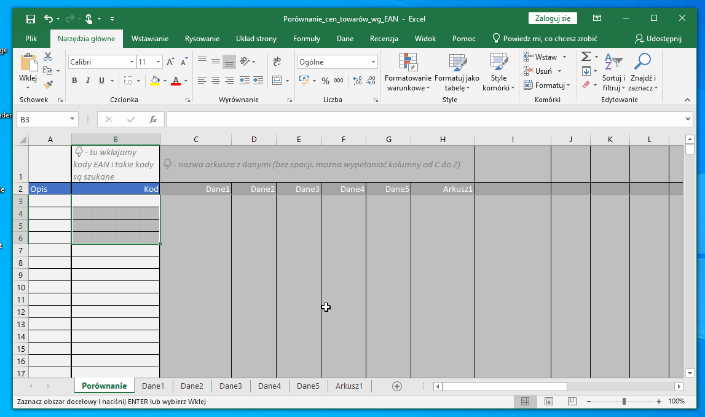
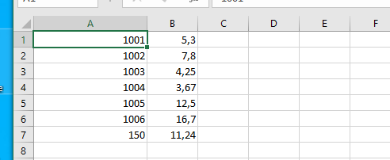
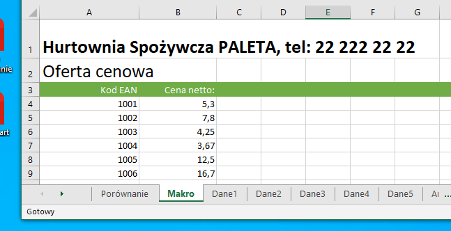
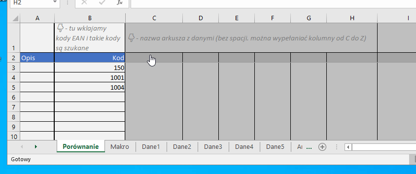
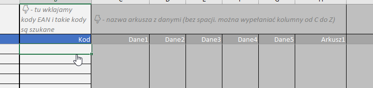

# Porównywarka cen według kodów EAN

Plik xlsx pozwala na porównanie cen przypisanych do kodów (EAN, krótkie, itp).

# 📁 [Pobierz plik *.xlsx](https://github.com/mieszkou/porownanie-cen-towarow-wg-ean/raw/master/Por%C3%B3wnanie_cen_towar%C3%B3w_wg_EAN.xlsx)

## Sposób użycia

### Przygotowanie danych do analizy/porównania

Dane wprowadzamy do wybranego lub nowego arkusza (z wyjątkiem arkusza `Porównanie`). W pierwszej kolumnie (`A`) musi być kod, w drugiej (`B`) cena. W pozostałych kolumnach arkusza mogą (ale nie muszą) być dowolne inne dane.

Możemy też umieścić dowolne dane nagłówkowe i formatowanie - nie powinny one powodować problemów.

> Nazwa arkusza nie może zawierać spacji !

### Przypisanie danych do kolumn w arkuszu `Porównanie`

W `2` wierszu w kolumnach od `C` do `Z` arkusza `Porównanie` wpisujemy nazwę arkusza przypisanego tej kolumnie (W dowolnej kolejności). 

### Szukamy najlepszej ceny 😀

W arkusz `Porównanie` w kolumnie `Kod` wpisujemy/wklajamy kolejne kody, które nas intersują. Są one szukane w wybranych arkuszach z danymi. Najnisza cena jest podświetlana.

